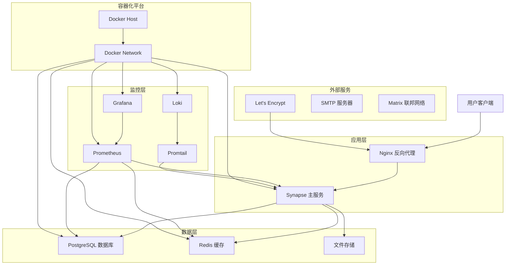
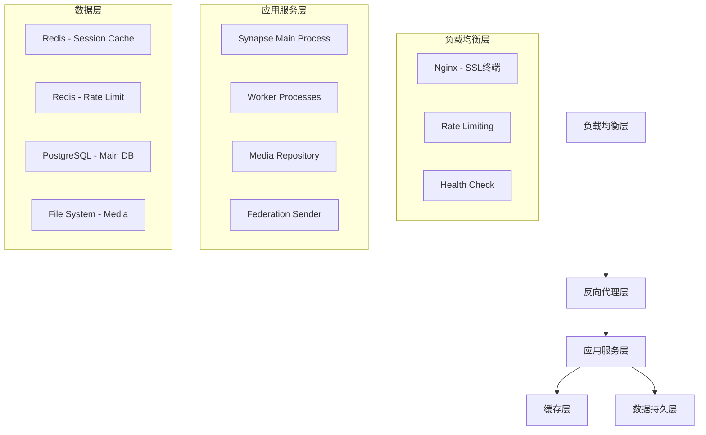
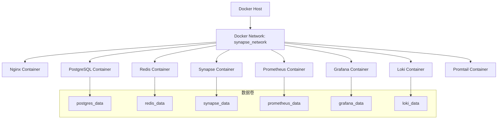
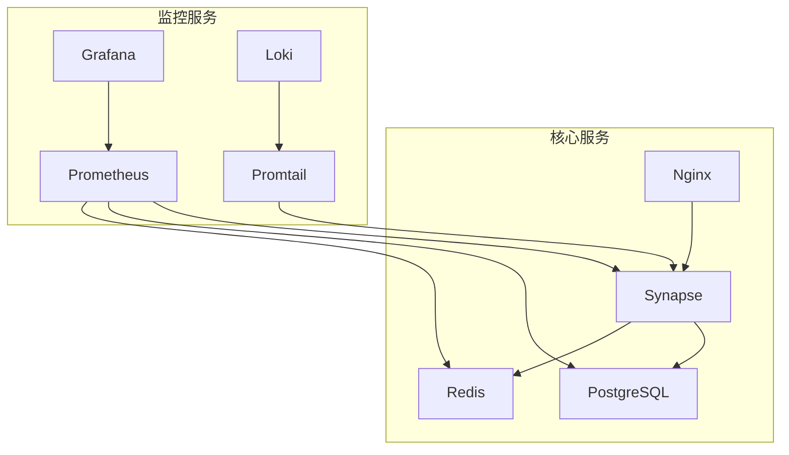
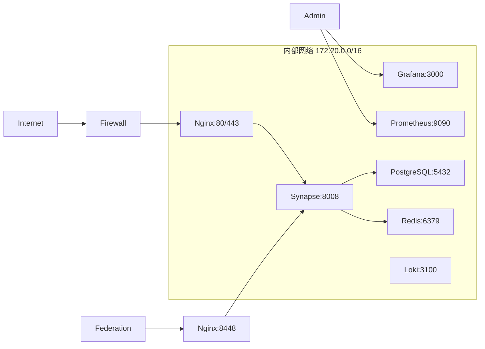
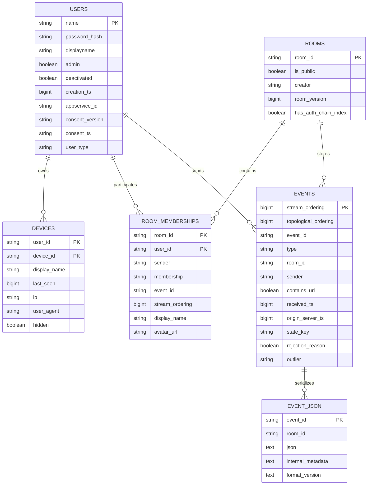

# Synapse Matrix 服务器技术架构文档

## 1. 架构设计

### 1.1 整体架构图



### 1.2 服务架构层次



## 2. 技术描述

### 2.1 核心技术栈

**前端接入层**:
- Nginx 1.24+ - 反向代理和负载均衡
- Let's Encrypt - 自动 SSL/TLS 证书管理
- HTTP/2 和 HTTP/3 支持

**应用服务层**:
- Python 3.11+ - 主要编程语言
- Synapse 1.95+ - Matrix 协议实现
- Twisted 23.8+ - 异步网络框架
- Pydantic 2.0+ - 数据验证和序列化

**数据存储层**:
- PostgreSQL 15+ - 主数据库
- Redis 7+ - 缓存和会话存储
- 本地文件系统 - 媒体文件存储

**容器化平台**:
- Docker 24+ - 容器运行时
- Docker Compose 2.20+ - 多容器编排
- Alpine Linux - 轻量级基础镜像

**监控和日志**:
- Prometheus 2.45+ - 指标收集
- Grafana 10+ - 可视化面板
- Loki 2.9+ - 日志聚合
- Promtail 2.9+ - 日志收集代理

### 2.2 关键依赖版本

```toml
# 核心 Python 依赖
Twisted = ">=23.8.0"
psycopg2 = ">=2.9.7"
cryptography = ">=41.0.0"
Pillow = ">=10.0.1"
jsonschema = ">=4.17.0"
attrs = ">=22.2.0"
netaddr = ">=0.8.0"
Jinja2 = ">=3.1.0"
bleach = ">=6.0.0"
typing-extensions = ">=4.5.0"
ijson = ">=3.2.0"
matrix-common = ">=1.3.0"
packaging = ">=23.1"
pydantic = ">=2.0.0"
setuptools_rust = ">=1.6.0"
python-multipart = ">=0.0.6"

# 可选依赖
psycopg2 = { version = ">=2.9.7", optional = true }
txredisapi = { version = ">=1.4.7", optional = true }
hiredis = { version = ">=2.2.3", optional = true }
sentry-sdk = { version = ">=1.25.0", optional = true }
opentracing = { version = ">=2.4.0", optional = true }
jaeger-client = { version = ">=4.8.0", optional = true }
```

## 3. 路由定义

### 3.1 前端路由

| 路由 | 目的 | 说明 |
|------|------|------|
| `/` | 主页重定向 | 重定向到 Matrix 客户端或欢迎页面 |
| `/_matrix/client/*` | 客户端 API | Matrix 客户端协议端点 |
| `/_matrix/federation/*` | 联邦 API | Matrix 服务器间通信端点 |
| `/_matrix/media/*` | 媒体 API | 文件上传、下载和缩略图 |
| `/_synapse/admin/*` | 管理 API | 服务器管理和配置接口 |
| `/health` | 健康检查 | 服务状态检查端点 |
| `/metrics` | 监控指标 | Prometheus 指标导出 |

### 3.2 Nginx 路由配置

```nginx
# Matrix 客户端 API
location /_matrix {
    proxy_pass http://synapse_backend;
    proxy_set_header Host $host;
    proxy_set_header X-Real-IP $remote_addr;
    proxy_set_header X-Forwarded-For $proxy_add_x_forwarded_for;
    proxy_set_header X-Forwarded-Proto $scheme;
    
    # WebSocket 支持
    proxy_http_version 1.1;
    proxy_set_header Upgrade $http_upgrade;
    proxy_set_header Connection "upgrade";
    
    # 限流配置
    limit_req zone=api burst=20 nodelay;
}

# 管理 API (限制访问)
location /_synapse/admin {
    # IP 白名单
    allow 127.0.0.1;
    allow 10.0.0.0/8;
    allow 172.16.0.0/12;
    allow 192.168.0.0/16;
    deny all;
    
    proxy_pass http://synapse_backend;
    proxy_set_header Host $host;
    proxy_set_header X-Real-IP $remote_addr;
    proxy_set_header X-Forwarded-For $proxy_add_x_forwarded_for;
    proxy_set_header X-Forwarded-Proto $scheme;
}

# 媒体文件 (启用缓存)
location /_matrix/media {
    proxy_pass http://synapse_backend;
    proxy_set_header Host $host;
    proxy_set_header X-Real-IP $remote_addr;
    proxy_set_header X-Forwarded-For $proxy_add_x_forwarded_for;
    proxy_set_header X-Forwarded-Proto $scheme;
    
    # 缓存配置
    proxy_cache media_cache;
    proxy_cache_valid 200 1d;
    proxy_cache_valid 404 1m;
    add_header X-Cache-Status $upstream_cache_status;
}
```

## 4. API 定义

### 4.1 核心 API 端点

#### 4.1.1 用户认证 API

**登录接口**
```
POST /_matrix/client/v3/login
```

Request:
| 参数名 | 参数类型 | 是否必需 | 描述 |
|--------|----------|----------|------|
| type | string | true | 登录类型 (m.login.password) |
| identifier | object | true | 用户标识符 |
| password | string | true | 用户密码 |
| device_id | string | false | 设备 ID |
| initial_device_display_name | string | false | 设备显示名称 |

Response:
| 参数名 | 参数类型 | 描述 |
|--------|----------|------|
| access_token | string | 访问令牌 |
| device_id | string | 设备 ID |
| home_server | string | 主服务器地址 |
| user_id | string | 用户 ID |
| well_known | object | 服务器发现信息 |

示例:
```json
{
  "type": "m.login.password",
  "identifier": {
    "type": "m.id.user",
    "user": "alice"
  },
  "password": "secret_password",
  "device_id": "GHTYAJCE"
}
```

#### 4.1.2 房间管理 API

**创建房间**
```
POST /_matrix/client/v3/createRoom
```

Request:
| 参数名 | 参数类型 | 是否必需 | 描述 |
|--------|----------|----------|------|
| name | string | false | 房间名称 |
| topic | string | false | 房间主题 |
| room_alias_name | string | false | 房间别名 |
| invite | array | false | 邀请用户列表 |
| preset | string | false | 房间预设 (private_chat, public_chat, trusted_private_chat) |
| is_direct | boolean | false | 是否为直接消息 |

#### 4.1.3 消息发送 API

**发送消息**
```
PUT /_matrix/client/v3/rooms/{roomId}/send/{eventType}/{txnId}
```

Request:
| 参数名 | 参数类型 | 是否必需 | 描述 |
|--------|----------|----------|------|
| msgtype | string | true | 消息类型 (m.text, m.image, m.file) |
| body | string | true | 消息内容 |
| format | string | false | 消息格式 |
| formatted_body | string | false | 格式化消息内容 |

### 4.2 管理 API

#### 4.2.1 用户管理

**获取用户列表**
```
GET /_synapse/admin/v2/users
```

Query Parameters:
| 参数名 | 参数类型 | 是否必需 | 描述 |
|--------|----------|----------|------|
| from | integer | false | 分页起始位置 |
| limit | integer | false | 每页数量 (默认 100) |
| guests | boolean | false | 是否包含访客用户 |
| deactivated | boolean | false | 是否包含已停用用户 |

**创建或修改用户**
```
PUT /_synapse/admin/v2/users/{user_id}
```

Request:
| 参数名 | 参数类型 | 是否必需 | 描述 |
|--------|----------|----------|------|
| password | string | false | 用户密码 |
| displayname | string | false | 显示名称 |
| threepids | array | false | 第三方标识符 (邮箱、手机) |
| admin | boolean | false | 是否为管理员 |
| deactivated | boolean | false | 是否停用 |

## 5. 服务器架构图

### 5.1 容器服务架构



### 5.2 服务依赖关系



### 5.3 网络架构



## 6. 数据模型

### 6.1 数据模型定义



### 6.2 数据定义语言 (DDL)

#### 6.2.1 用户表 (users)

```sql
-- 创建用户表
CREATE TABLE users (
    name TEXT PRIMARY KEY,
    password_hash TEXT,
    creation_ts BIGINT,
    admin BOOLEAN DEFAULT FALSE,
    upgrade_ts BIGINT,
    is_guest BOOLEAN DEFAULT FALSE,
    appservice_id TEXT,
    consent_version TEXT,
    consent_ts BIGINT,
    consent_server_notice_sent TEXT,
    user_type TEXT,
    deactivated BOOLEAN DEFAULT FALSE,
    UNIQUE(name)
);

-- 创建索引
CREATE INDEX users_creation_ts ON users(creation_ts);
CREATE INDEX users_deactivated ON users(deactivated);
CREATE INDEX users_user_type_is_guest ON users(user_type, is_guest);

-- 设置权限
GRANT SELECT ON users TO anon;
GRANT ALL PRIVILEGES ON users TO authenticated;
```

#### 6.2.2 房间表 (rooms)

```sql
-- 创建房间表
CREATE TABLE rooms (
    room_id TEXT PRIMARY KEY,
    is_public BOOLEAN,
    creator TEXT,
    room_version TEXT,
    has_auth_chain_index BOOLEAN
);

-- 创建索引
CREATE INDEX rooms_is_public ON rooms(is_public);
CREATE INDEX rooms_creator ON rooms(creator);

-- 设置权限
GRANT SELECT ON rooms TO anon;
GRANT ALL PRIVILEGES ON rooms TO authenticated;
```

#### 6.2.3 事件表 (events)

```sql
-- 创建事件表
CREATE TABLE events (
    stream_ordering BIGINT PRIMARY KEY,
    topological_ordering BIGINT NOT NULL,
    event_id TEXT NOT NULL,
    type TEXT NOT NULL,
    room_id TEXT NOT NULL,
    sender TEXT NOT NULL,
    contains_url BOOLEAN,
    received_ts BIGINT,
    origin_server_ts BIGINT NOT NULL,
    state_key TEXT,
    rejection_reason TEXT,
    outlier BOOLEAN NOT NULL,
    UNIQUE(event_id)
);

-- 创建索引
CREATE INDEX events_event_id ON events(event_id);
CREATE INDEX events_room_id ON events(room_id);
CREATE INDEX events_sender ON events(sender);
CREATE INDEX events_type ON events(type);
CREATE INDEX events_ts ON events(origin_server_ts);
CREATE INDEX events_topological_ordering ON events(room_id, topological_ordering);

-- 设置权限
GRANT SELECT ON events TO anon;
GRANT ALL PRIVILEGES ON events TO authenticated;
```

#### 6.2.4 设备表 (devices)

```sql
-- 创建设备表
CREATE TABLE devices (
    user_id TEXT NOT NULL,
    device_id TEXT NOT NULL,
    display_name TEXT,
    last_seen BIGINT,
    ip TEXT,
    user_agent TEXT,
    hidden BOOLEAN DEFAULT FALSE,
    PRIMARY KEY (user_id, device_id)
);

-- 创建索引
CREATE INDEX devices_user_id ON devices(user_id);
CREATE INDEX devices_last_seen ON devices(last_seen);

-- 设置权限
GRANT SELECT ON devices TO anon;
GRANT ALL PRIVILEGES ON devices TO authenticated;
```

#### 6.2.5 初始化数据

```sql
-- 创建默认管理员用户 (需要在部署后手动设置密码)
INSERT INTO users (name, admin, creation_ts, deactivated) 
VALUES ('@admin:' || current_setting('synapse.server_name'), TRUE, 
        extract(epoch from now()) * 1000, FALSE)
ON CONFLICT (name) DO NOTHING;

-- 创建系统房间
INSERT INTO rooms (room_id, is_public, creator, room_version) 
VALUES ('!system:' || current_setting('synapse.server_name'), FALSE, 
        '@admin:' || current_setting('synapse.server_name'), '9')
ON CONFLICT (room_id) DO NOTHING;

-- 设置数据库配置
ALTER SYSTEM SET shared_preload_libraries = 'pg_stat_statements';
ALTER SYSTEM SET max_connections = 200;
ALTER SYSTEM SET shared_buffers = '256MB';
ALTER SYSTEM SET effective_cache_size = '1GB';
ALTER SYSTEM SET maintenance_work_mem = '64MB';
ALTER SYSTEM SET checkpoint_completion_target = 0.9;
ALTER SYSTEM SET wal_buffers = '16MB';
ALTER SYSTEM SET default_statistics_target = 100;
ALTER SYSTEM SET random_page_cost = 1.1;
ALTER SYSTEM SET effective_io_concurrency = 200;

-- 重新加载配置
SELECT pg_reload_conf();
```

### 6.3 性能优化配置

#### 6.3.1 PostgreSQL 优化

```sql
-- 创建分区表 (用于大型部署)
CREATE TABLE events_partitioned (
    LIKE events INCLUDING ALL
) PARTITION BY RANGE (origin_server_ts);

-- 创建月度分区
CREATE TABLE events_2024_01 PARTITION OF events_partitioned
FOR VALUES FROM (1704067200000) TO (1706745600000);

-- 自动分区管理函数
CREATE OR REPLACE FUNCTION create_monthly_partition()
RETURNS void AS $$
DECLARE
    start_date timestamp;
    end_date timestamp;
    partition_name text;
BEGIN
    start_date := date_trunc('month', now());
    end_date := start_date + interval '1 month';
    partition_name := 'events_' || to_char(start_date, 'YYYY_MM');
    
    EXECUTE format('CREATE TABLE IF NOT EXISTS %I PARTITION OF events_partitioned
                    FOR VALUES FROM (%L) TO (%L)',
                   partition_name,
                   extract(epoch from start_date) * 1000,
                   extract(epoch from end_date) * 1000);
END;
$$ LANGUAGE plpgsql;

-- 定期清理旧数据
CREATE OR REPLACE FUNCTION cleanup_old_events()
RETURNS void AS $$
BEGIN
    -- 删除 90 天前的事件
    DELETE FROM events 
    WHERE origin_server_ts < extract(epoch from now() - interval '90 days') * 1000;
    
    -- 清理孤立的事件 JSON
    DELETE FROM event_json 
    WHERE event_id NOT IN (SELECT event_id FROM events);
END;
$$ LANGUAGE plpgsql;
```

#### 6.3.2 Redis 配置优化

```redis
# redis.conf 优化配置
maxmemory 256mb
maxmemory-policy allkeys-lru
save 900 1
save 300 10
save 60 10000
stop-writes-on-bgsave-error yes
rdbcompression yes
rdbchecksum yes
tcp-keepalive 300
timeout 0
tcp-backlog 511
databases 16

# 性能优化
hash-max-ziplist-entries 512
hash-max-ziplist-value 64
list-max-ziplist-size -2
list-compress-depth 0
set-max-intset-entries 512
zset-max-ziplist-entries 128
zset-max-ziplist-value 64

# 日志配置
loglevel notice
logfile "/var/log/redis/redis-server.log"
syslog-enabled yes
syslog-ident redis
```

## 7. 安全配置

### 7.1 网络安全

```bash
# UFW 防火墙配置
sudo ufw default deny incoming
sudo ufw default allow outgoing
sudo ufw allow ssh
sudo ufw allow 80/tcp
sudo ufw allow 443/tcp
sudo ufw allow 8448/tcp
sudo ufw --force enable

# 限制 SSH 访问
echo "AllowUsers synapse" | sudo tee -a /etc/ssh/sshd_config
echo "PasswordAuthentication no" | sudo tee -a /etc/ssh/sshd_config
echo "PermitRootLogin no" | sudo tee -a /etc/ssh/sshd_config
sudo systemctl restart ssh
```

### 7.2 应用安全

```yaml
# Synapse 安全配置
enable_registration: false
registration_requires_token: true
allow_guest_access: false
enable_metrics: true
report_stats: false

# 速率限制
rc_message:
  per_second: 0.2
  burst_count: 10

rc_registration:
  per_second: 0.17
  burst_count: 3

rc_login:
  address:
    per_second: 0.17
    burst_count: 3
  account:
    per_second: 0.17
    burst_count: 3
  failed_attempts:
    per_second: 0.17
    burst_count: 3

# 媒体限制
max_upload_size: 50M
max_image_pixels: 32M
max_spider_size: 10M

# 安全头
use_presence: true
require_auth_for_profile_requests: true
limit_profile_requests_to_users_who_share_rooms: true
allow_public_rooms_without_auth: false
```

本技术架构文档详细描述了 Synapse Matrix 服务器的完整技术实现，包括系统架构、技术栈选择、API 设计、数据模型和安全配置，为项目的部署和维护提供了全面的技术指导。