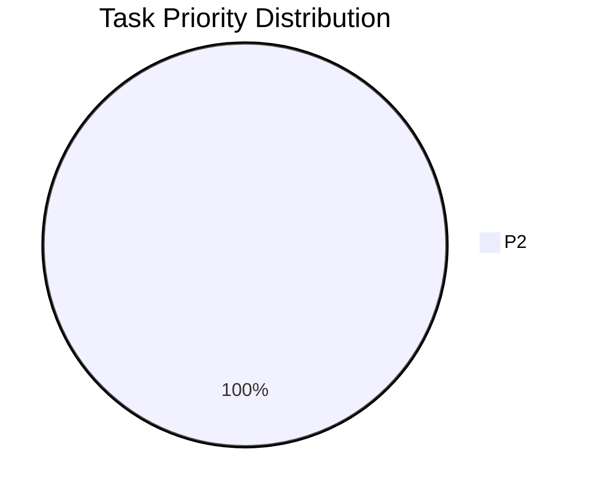

# Unfinished Tasks Report (20260201_114736)

## Executive Summary
- **Total Tasks**: 20
- **Critical (P0)**: 0
- **High (P1)**: 0

## Priority Distribution

## Top 10 High Priority Tasks
| ID | Priority | Type | Description | File |
|----|----------|------|-------------|------|
| TASK-GEN-20260000 | P2 | 优化 | 优化 `thumbnail_sizes` 与 `max_image_pixels` \| 减少不必要的... | `docs/synapse-rust/optimization-plan.md:9` |
| TASK-GEN-20260001 | P2 | 优化 | 优化 | `docs/synapse-rust/architecture-comparison-analysis.md:806` |
| TASK-GEN-20260002 | P2 | 优化 | 优化 | `docs/synapse-rust/architecture-comparison-analysis.md:1844` |
| TASK-GEN-20260003 | P2 | 优化 | 优化                                             │ | `docs/synapse-rust/implementation-plan.md:134` |
| TASK-GEN-20260004 | P2 | 优化 | 优化 | `docs/synapse-rust/implementation-plan.md:582` |
| TASK-GEN-20260005 | P2 | 优化 | 优化 Cargo 编译配置，提升性能 | `docs/synapse-rust/implementation-plan.md:1617` |
| TASK-GEN-20260006 | P2 | 优化 | 优化 release profile | `docs/synapse-rust/implementation-plan.md:1620` |
| TASK-GEN-20260007 | P2 | 优化 | 优化 | `docs/synapse-rust/enhanced-development-guide.md:1141` |
| TASK-GEN-20260008 | P2 | 优化 | 优化 | `docs/synapse-rust/enhanced-development-guide.md:1158` |
| TASK-GEN-20260009 | P2 | 优化 | 优化 \| 22ms \| JSON \| **性能瓶颈**：在大数据量下统计耗时较长，建议增加 Redi... | `docs/synapse-rust/api-reference.md:231` |

## Risk Assessment
✅ No critical blockers found.
